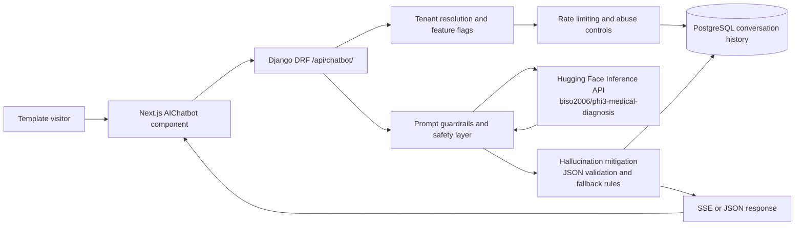

# Medical AI Chatbot Architecture

## Overview

This Medify feature adds a tenant-aware medical chatbot for pharmacy templates using the Hugging Face model `biso2006/phi3-medical-diagnosis`.

Core goals:
- collect patient symptoms and ask follow-up questions
- suggest possible conditions without presenting them as diagnoses
- recommend appropriate medical specialties
- provide general medical guidance
- always append a medical disclaimer
- support tenant-level enablement for purchased templates
- keep the Hugging Face token server-side only

## Production flow

1. A pharmacy template embeds the reusable `AIChatbot` component.
2. The widget identifies the tenant by authenticated owner session or `subdomain`.
3. Next.js posts the message to `POST /api/chatbot/`.
4. Django resolves the tenant, enforces feature flags, checks rate limits, and stores the user message.
5. Django builds a constrained system prompt and sends it to Hugging Face.
6. The parsed response is normalized into Medify's safe response schema.
7. Django stores the assistant reply, then returns JSON or streams it as Server-Sent Events.
8. The frontend renders chat bubbles, follow-up questions, likely specialties, and the disclaimer.

## Mermaid diagram



## Database schema

### `template_ai_settings`
- `website_setup_id`: one-to-one tenant link
- `enabled`: tenant switch for the chatbot
- `provider`: provider name, default `huggingface`
- `model_id`: model identifier
- `system_prompt_version`: prompt version tag
- `disclaimer`: per-tenant disclaimer override
- `max_history_messages`: prompt history budget
- `max_new_tokens`: generation cap
- `temperature`: low-temperature setting for stability
- `per_ip_rate_limit`: requests allowed per window
- `rate_limit_window_seconds`: burst window
- `follow_up_question_limit`: response limit
- `specialty_catalog`: optional tenant-specific specialty whitelist

### `chat_conversations`
- `website_setup_id`: tenant partition key
- `visitor_id`: anonymous or authenticated client identifier
- `locale`: language tag
- `title`: derived from first user message
- `status`: open, closed, escalated
- `last_risk_level`: self_care, routine, urgent, emergency
- `last_suggested_conditions`: cached assistant summary
- `last_recommended_specialties`: cached assistant summary
- `metadata`: extensible analytics and audit data

### `chat_messages`
- `conversation_id`: parent conversation
- `role`: system, user, assistant
- `content`: rendered content returned to the user
- `model_name`: source model used
- `safety_flags`: urgency and escalation flags
- `metadata`: follow-up questions, guidance, confidence note
- `created_at`: audit timestamp

## Security recommendations

- Keep `HUGGINGFACE_API_TOKEN` only on the Django server. Never expose it to Next.js or the browser.
- Restrict outbound requests from the backend to Hugging Face only.
- Use PostgreSQL in production and encrypt backups.
- Partition all chatbot records by `website_setup_id`.
- Enforce per-IP and per-tenant rate limits.
- Log provider failures without logging secrets.
- Add moderation and abuse alerts for repeated emergency-trigger or unsafe-content attempts.
- Prefer HTTPS everywhere and enable secure headers and CSRF-aware deployment defaults.

## Prompting strategy

The backend uses a constrained system prompt that forces JSON output and repeats the disclaimer requirement. It also limits the assistant to possibilities rather than diagnoses and blocks medication dosing advice.

Example internal prompt excerpt:

```text
You are MedifyCare, a cautious medical triage assistant embedded inside a pharmacy website.
- Never claim certainty or provide a definitive diagnosis.
- Never recommend prescription-only treatment plans or medication dosing.
- Never ignore emergency symptoms.
- Always include the exact disclaimer from the tenant settings.
- Output valid JSON only with keys: answer, follow_up_questions, possible_conditions,
  recommended_specialties, guidance, urgency, seek_emergency_care, confidence_note, disclaimer.
```

## Streaming note

The endpoint supports Server-Sent Events. Hugging Face's standard inference endpoint does not guarantee token-by-token streaming for every hosted model, so Medify streams the normalized assistant text in chunks after the provider response returns. This keeps the frontend streaming-compatible without coupling the UI to provider-specific behavior.
